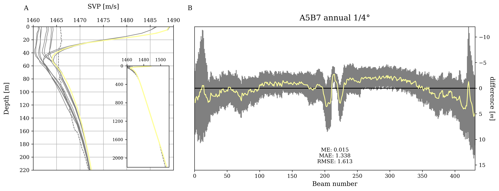

# MB-System-Best-WOA18-SVP
MB-System tool to download World Ocean Atlas 2018 (WOA18) temperature and salinity files, calculate the sound velocity using the [UNESCO](https://repository.oceanbestpractices.org/handle/11329/109) formula with corrective terms as well as the recalculated coefficients by [Wong and Zhu](https://doi.org/10.1121/1.413048) and the [Leroy](https://doi.org/10.1121/1.2988296) formula over all standard depths, applying them on a flat seafloor swathfile and find the best World Ocean Atlas 2018 sound velocity profiles for sound speed correction of a survey.

## General idea and preparation
Sound velocity profiles (SVP) are important for sound speed correction, however sometimes conditions at sea and time constraints lead to insufficient or no SVPS at all. The idea of this tool is to somewhat compensate for that by utilizing the World Ocean Atlas 2018 temperature and salinity data that are based on real in-situ measurements interpolated over several decades for different times, spatial resolutions and standard depths. Under the assumption of a rather flat seafloor, the detected depths of the beams of a multibeam ping should lay on a straight line if the applied SVP is a good/perfect one. If not, the calculated bathymetry will bend either upwards or downwards, especially on the outer beams as shown in the two images below. 


In order to evaluate the accuracy of SVPs and to compare them against one another the residuals of the individual pings per beam can be calculated. These residuals are the difference between a linear fit of a ping and the actual value for all the beams within that ping. In order to objectively analyze the flattening of the averaged residuals some metrics like the mean error (ME), the mean absolute error (MAE) and the root mean square error (RMSE) were used. All three of the metrics give information on the error between an actual value and a predicted value. The averaged residuals calculated from each SVP applied are the actual values and a value of 0 for each beam number represents the predicted value. Continuous residual values of 0 over all beams of the swath represent a perfectly linear and ideal ping. The closer the calculated residuals are to this perfect line the better they smooth the calculated bathymetry during ray tracing, resulting in better bathymetry maps under the assumption of a flat seafloor.


This tool applies a number of WOA18-derived and additional (if present) SVPs that fit the temporal and spatial parameters of the provided swathfile over a flat area and returns a ranking of these. Since there are more than one equation to for sound velocity calculation two formulas are currently supported and treated as individual profiles leading up to 26 WOA18 SVPs per swathfile. This flat seafloor (part of a larger survey) evaluated SVP could than be used to correct the whole survey and improve bathymetry maps.

## Programs of this tool

| Program                 | Description
|-------------------------|-----------------------------------------------------------------------------------------------------------------------------------------------------------------------------------------------------------------------------------------------------------------------------------------------------------------------------------------------------------------------------------------------------|
| mbdownloadwoa18         | Extracts WOA18 temperature and salinity for a specified area, calculates the UNESCO and Leroy sound velocites for each grid cell and standard depth and stores them as netcdf files together with an overview map of the specified area extracted.
| mbbestsvp               | Calculates/extracts several SVP files based on the date and extent of a swathfile (flat seafloor), by either using the mean of 4 surrounding profiles or by using the closest grid point. All SVPs are applied and their capability of flattening the seafloor is evaluated and ranked against one another, including the SVPs stored in the swathfile itself.


### mbdownloadwoa18

The **mbdownloadwoa18** can be used directly from the command line and takes the following arguments:

- **--area/-A**: Minimum and maximum longitude and latitude of the area of interest. Due to the nature of the dataset and the lack of circular axis support in xarray (to handle netcdf files) the longitude goes from -180 to 180, thus cutting through the Pacific. If interested in e.g. the whole Pacific a positive minimum longitude (e.g. 160) and a negative maximum latitude (e.g. -140) as the first two arguments allows for cropping across the Pacific by rolling the dataset within xarray (takes a bit more time). If setting min and max longitude both to 0 than the whole dataset is downloaded but rolled by 180 degree so that the dataset is 'cut' at 0 meridian. If not using this flag the dataset is downloaded from -180 to 180 degree. So for most applications this should not be an issue, but if working within the Pacific you might want to make use of the aforementioned ways to avoid the cut through the Pacific.

- **--outputfolder/-O**: Folder path to where to store the cropped and calculated sound velocity netcdf files. If you work in several areas you might want to create a folder for each of these like Baltic Sea and one for the Sea of Japan with that were also calculated with their respective corrective terms.

- **--period/-P**: Select if you want to use the "decav" which is the average of six decadal means from 1955 to 2017 and/or the "A5B7" which is the average from 2005 to 2017 (global coverage of Argo floats from 2005). If not using this flag both periods are used.

- **--resolution/-R**: Select if you want to use the coarser 1° (01) or the finer 0.25° (04) grid resolution. If not using this flag both resolutions are used.

- **--time/-T**: Select which times from the following you want to download: annual (00), months (01 to 12) and seasons consisting of winter (13), spring (14), summer (15) and autumn (16). If not using this flag all times will be downloaded. Note: for the evaluation of the best SVP only the times that are the same as the start or end time of the swathfile will be considered so always the annual, one month and one season corresponding to the month.

- **--correctiveterm/-C**: The corrective term dictates which formula is used for calculating the pressure which is required for calculating sound velocities with the UNESCO formula. Several of these exist and are described by [Leroy and Parthiot](https://doi.org/10.1121/1.421275). All of these corrective terms are supported by the tool (see help flag of the program for a full list of abbreviations).

The user will end up with a set of netcdf files corersponding to the specified parameters mentioned above and an image showing the map extent. These files are required for the evaluation of the best SVP when using **mbbestsvp** (see below).

### mbbestsvp

The **mbbestsvp** can be used directly from the command line and takes the following arguments:

- **--nearest/-N**: If the flag is called then the nearest grid point will be used. If not used the mean of the four surrounding grid points is used to generate a SVP profile.

- **--period/-P**: Select if you want to use the "decav" which is the average of six decadal means from 1955 to 2017 and/or the "A5B7" which is the average from 2005 to 2017 (global coverage of Argo floats from 2005). If not using this flag both periods are used.

- **--resolution/-R**: Select if you want to use the coarser 1° (01) or the finer 0.25° (04) grid resolution. If not using this flag both resolutions are used.

- **--swathfile/-I**: The swathfile/datalist to apply the svp on. This file should be a flat area in order to evaluate the SVPs.

- **--svpfolder/-S**: The user needs to specify the path where the calculated (and cropped) SVP netcdf files are stored, that were created using "mbdownloadwoa18".

- **--outputfolder/-O**: Specify a folder where to store the final SVP profiles that will be applied on the swathfile. If nothing provided the default will be: './svpprofiles'.

- **--enddate/-E**: If this flag is provided the end date based on the mbinfo of the swathfile will be used to determine which WOA18 times to be used. If not the start date will be used.

The user will end up with a subfolder containing all the SVP profiles for the swathfile from the WOA18, a subfolder (svppngs) with images illustrating the flattening effect together with some metrics and a ranking of all files based on the root mean squared error (RMSE) in the terminal where the lowest RMSE represents the 'best' SVP.

## Example (Black Sea)
```
python mbdownloadwoa18.py -O F:\test -T 01 -R 01 -A 27 43 40 49
```





## Requirements

### MB-System
Since this tool utilizes MB-System and is meant to work in conjuction with other MB-System programs one should download and install MB-System. Please see also [dwcaress/MB-System](https://github.com/dwcaress/MB-System) from which also the below information was copied from:

The primary source of information about MB-System is the project website at [https://www.mbari.org/products/research-software/mb-system/](https://www.mbari.org/products/research-software/mb-system/), which includes sections on:

- [FAQ](https://www.mbari.org/products/research-software/mb-system/mb-system-faq/)
- [Download and installation](https://www.mbari.org/products/research-software/mb-system/how-to-download-and-install-mb-system/)
- [Documentation](https://www.mbari.org/products/research-software/mb-system/mb-system-documentation/)
- [User and developer email discussion lists](https://www.mbari.org/products/research-software/mb-system/mb-system-discussion-lists/)

### Python modules

Some of these modules below need to be installed, some of them might already be installed and/or are part of core python:

- argparse
- cartopy
- datetime
- gc
- io
- matplotlib
- numpy
- pandas
- pathlib
- re
- subprocess
- xarray (with dependencies)

## Todos

- [ ] Implementation into MB-System.
- [ ] Making sure all required python modules are present and/or setting up a python envrionment to guarantee correct execution (see above).
- [ ] Making the "Pacific issue" somwhat smarter and more efficient.
- [ ] Create a GUI.
